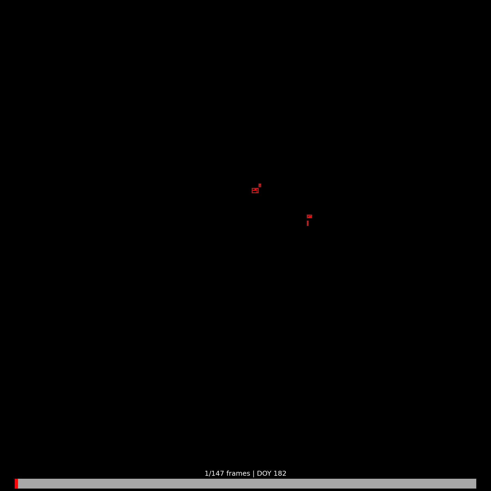
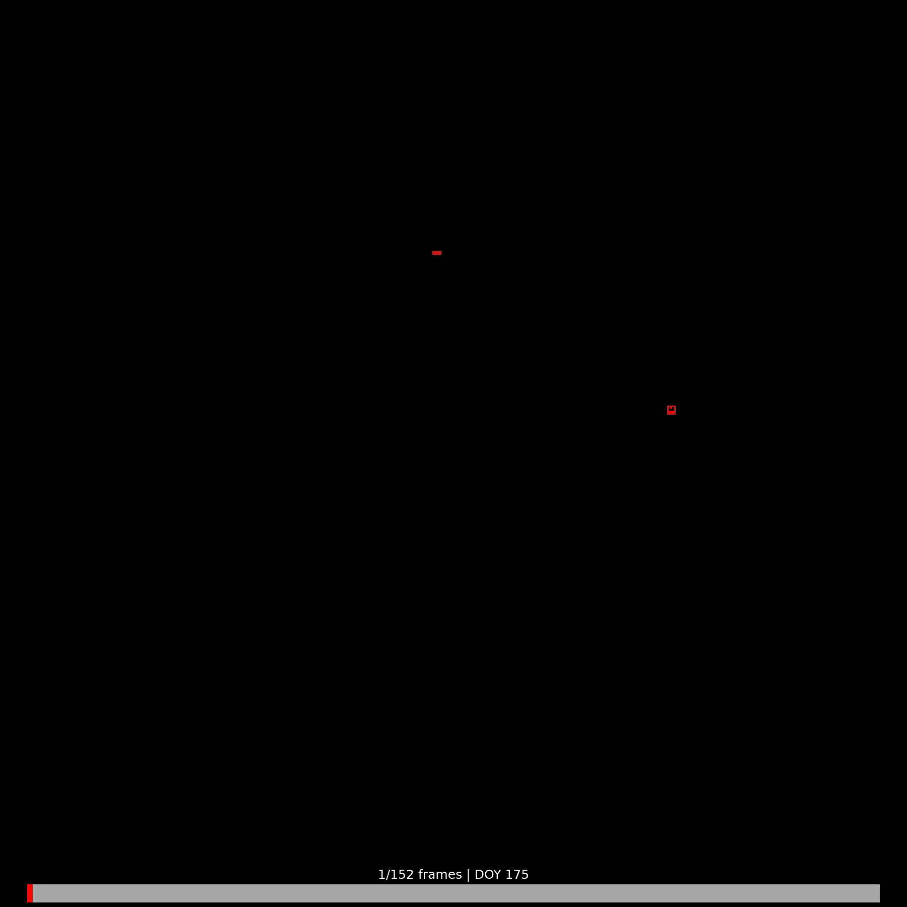
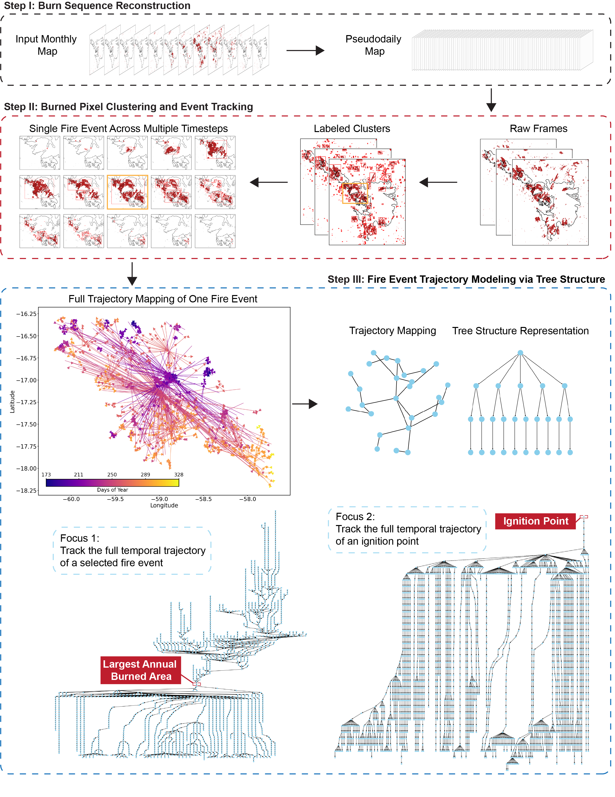

# Berkeley FLARE (Fire Lineage and Reconstruction Engine)

## Overview
This repository hosts the fire event-tracking algorithm and the associated fire-event dataset as presented in: *Pu et al., A Song of Water and Fire: An Event-Centric Framework to Track Megafire Dynamics in the World’s Largest Wetland (under review, 2026).*

### Snapshot of largest wildfire event (zoom in) for selected years in the Pantanal.
<table style="border: none; border-collapse: collapse;">
  <tr style="border: none;">
    <td width="200" align="center" style="border: none;">2024</td>
    <td width="200" align="center" style="border: none;">2021</td>
    <td width="200" align="center" style="border: none;">2020</td>
    <td width="200" align="center" style="border: none;">2010</td>
  </tr>
</table>

### The Framework

  <!-- LEFT: image -->
  

    
  

  <!-- RIGHT: text -->
  

By adapting **multi-object tracking (MOT)** principles to satellite-derived burned-area observations, FLARE formalizes wildfire dynamics as a system of **spatiotemporally evolving objects**.

Rather than treating fire as static pixel aggregates, the framework reconstructs a **lineage-resolved event database**, enabling process-level understanding of wildfire behavior.

The algorithm resolves wildfire evolution through four key components:

- 🔥 **Ignition**  
  Identification of the spatiotemporal origin of new fire events.

- 📈 **Propagation & Expansion**  
  Continuous tracking of fire growth, spread, and perimeter evolution.

- 🔀 **Topological Transitions**  
  Explicit handling of **merging** and **splitting** behaviors.

- 🌿 **Event Lineage**  
  A complete "family tree" of fire development from ignition to extinction.

    👉 Example visualization of event lineage:  
    [`Fire lineage Sankey diagram (2024, event 616)`](fire_sankey_year2024_lineageid_616.html)

  

### Repository Structure

This repository is organized around the **FLARE framework**, its supporting datasets, and demonstration workflows.

- **data/**  
  Lineage-resolved fire-event database (2001–2024) generated by the FLARE framework, stored in **SQLite format** (`.db`). The database encodes event-level attributes such as fire extent, duration, and spatiotemporal lineage structure. A quick exploration example is provided in [`demo_dataset_exploration.ipynb`](demo_dataset_exploration.ipynb).

- **demo/**  
  End-to-end demonstration workflow, including example inputs, intermediate files, outputs, and validation results.  

  The core reconstruction algorithm is implemented in [`flare_event_reconstruction.py`](flare_event_reconstruction.py), with a step-by-step workflow illustrated in  
  [`demo/Fire Event Reconstruction Workflow.ipynb`](demo/Fire%20Event%20Reconstruction%20Workflow.ipynb).

  - **demo/input/** — example input data  
  - **demo/intermediate/** — intermediate processing outputs  
  - **demo/output/** — reconstructed fire-event products  
  - **demo/validation/** — validation and comparison results  

- **media/**  
  Figures, workflow diagrams, and animations used in the documentation.
---
